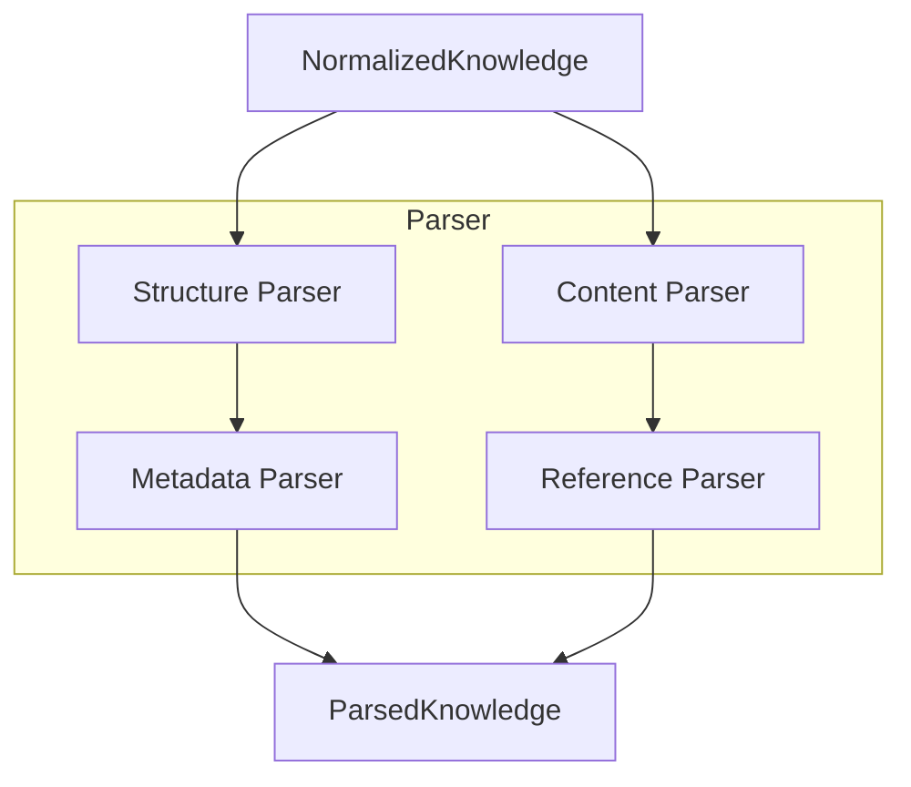
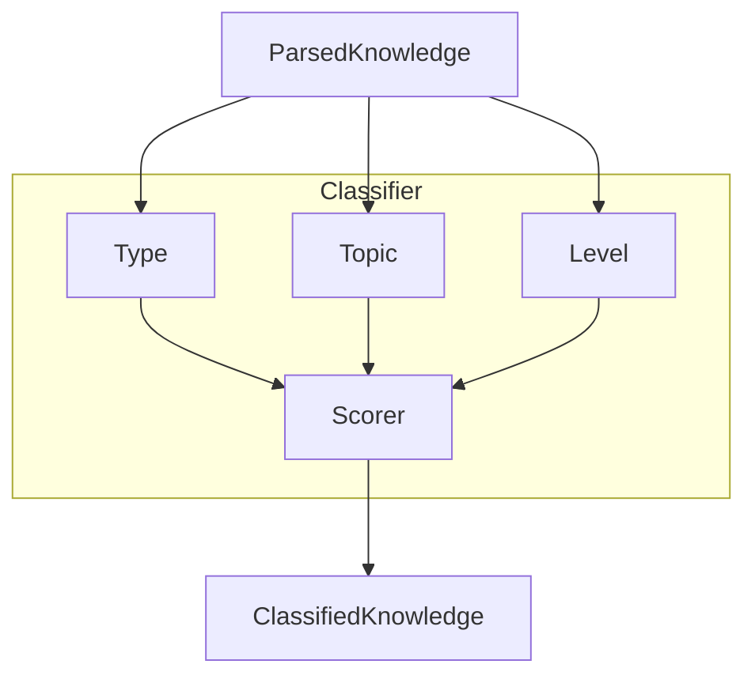
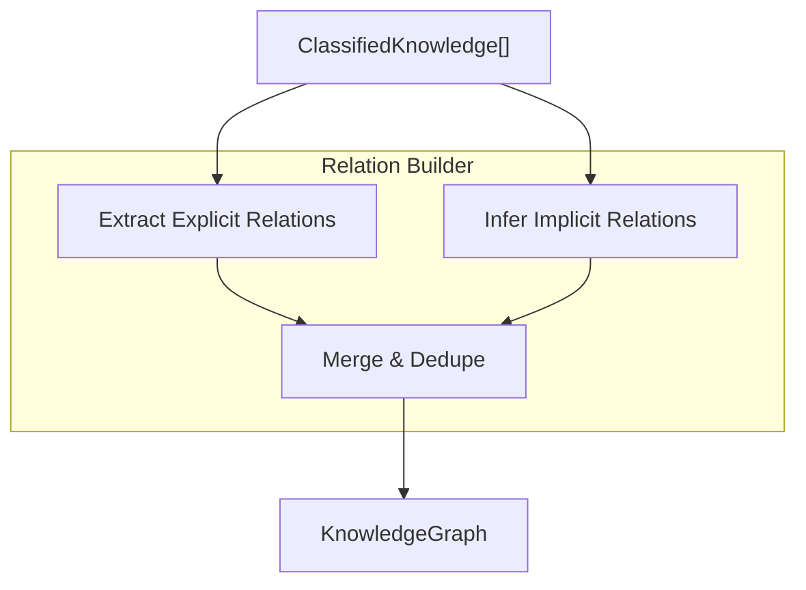
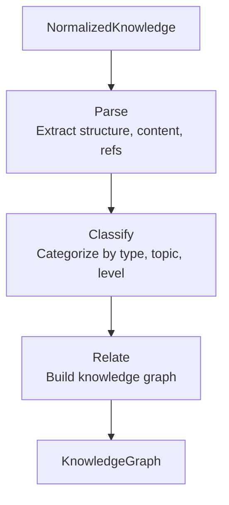

# Analyze Protocol

> Knowledge parsing, classification, and relation building

---

## 1. Overview

The Analyze protocol (A in SAGE) processes normalized knowledge to extract structure, classify content, and build relationships in the knowledge graph.

## Table of Contents

- [1. Overview](#1-overview)
- [2. Responsibilities](#2-responsibilities)
- [3. Parsing](#3-parsing)
- [4. Classification](#4-classification)
- [5. Relation Building](#5-relation-building)
- [6. Analysis Pipeline](#6-analysis-pipeline)
- [7. Configuration](#7-configuration)
- [Related](#related)

---

## 2. Responsibilities

| Operation | Purpose | Output |
|-----------|---------|--------|
| **Parse** | Extract structure and meaning | ParsedKnowledge |
| **Classify** | Categorize by type and topic | ClassifiedKnowledge |
| **Relate** | Build knowledge graph | KnowledgeGraph |

---

## 3. Parsing

### 3.1 Parse Operations

| Operation | Purpose | Example |
|-----------|---------|---------|
| **Structure** | Extract document structure | Headings, sections |
| **Content** | Extract meaningful content | Text, code, tables |
| **Metadata** | Extract embedded metadata | Tags, categories |
| **References** | Extract links and citations | URLs, file refs |

### 3.2 Parsing Flow


### 3.3 Parsed Knowledge Structure

```python
@dataclass
class ParsedKnowledge:
    id: str
    source: NormalizedKnowledge
    structure: DocumentStructure
    content: list[ContentBlock]
    metadata: ExtractedMetadata
    references: list[Reference]
```
---

## 4. Classification

### 4.1 Classification Dimensions

| Dimension | Purpose | Example Values |
|-----------|---------|----------------|
| **Type** | Document type | guide, reference, tutorial |
| **Topic** | Subject area | architecture, api, config |
| **Level** | Complexity | beginner, intermediate, advanced |
| **Priority** | Importance | ★★★★★ to ★☆☆☆☆ |

### 4.2 Classification Flow


### 4.3 Classification Result

```python
@dataclass
class ClassifiedKnowledge:
    id: str
    parsed: ParsedKnowledge
    classifications: list[Classification]
    confidence: float
    tags: set[str]
```
---

## 5. Relation Building

### 5.1 Relation Types

| Type | Description | Example |
|------|-------------|---------|
| **References** | Explicit links | `[link](file.md)` |
| **Hierarchy** | Parent-child | directory → file |
| **Similarity** | Content similarity | Similar topics |
| **Sequence** | Order relationship | Step 1 → Step 2 |
| **Dependency** | Requires relationship | A depends on B |

### 5.2 Relation Flow


### 5.3 Knowledge Graph Structure

```python
@dataclass
class KnowledgeGraph:
    nodes: dict[str, KnowledgeNode]
    edges: list[KnowledgeEdge]
    
@dataclass
class KnowledgeNode:
    id: str
    knowledge: ClassifiedKnowledge
    
@dataclass
class KnowledgeEdge:
    source: str
    target: str
    relation_type: str
    weight: float
```
---

## 6. Analysis Pipeline


---

## 7. Configuration

```yaml
analyze:
  parsing:
    extract_code_blocks: true
    extract_tables: true
    max_depth: 6
  
  classification:
    auto_tag: true
    confidence_threshold: 0.7
  
  relations:
    infer_similarity: true
    similarity_threshold: 0.8
```
---

## Related

- `SOURCE_PROTOCOL.md` — Previous phase
- `GENERATE_PROTOCOL.md` — Next phase
- `SAGE_PROTOCOL.md` — Protocol overview

---

*AI Collaboration Knowledge Base*
