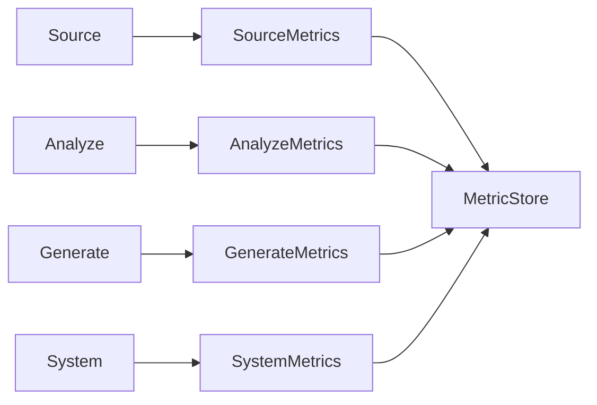
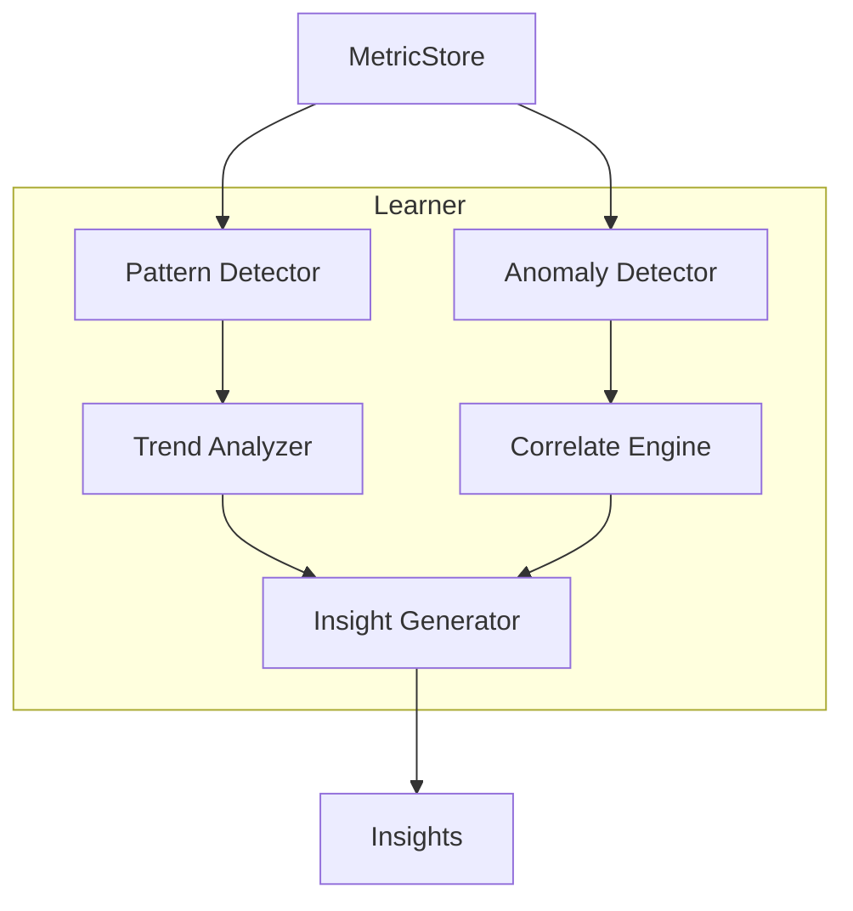
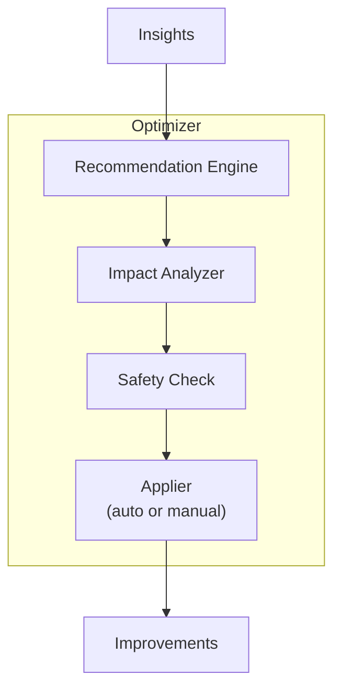
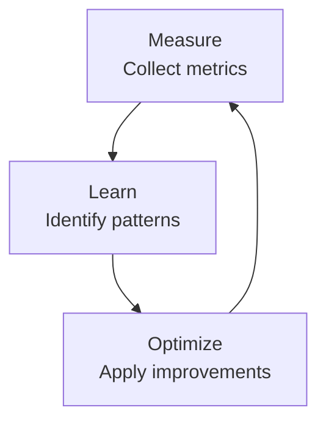

# Evolve Protocol

> Measurement, learning, and continuous optimization

---

## 1. Overview

The Evolve protocol (E in SAGE) closes the feedback loop by measuring performance, learning from patterns, and applying optimizations.


## Table of Contents

- [1. Overview](#1-overview)
- [2. Responsibilities](#2-responsibilities)
- [3. Measurement](#3-measurement)
- [4. Learning](#4-learning)
- [5. Optimization](#5-optimization)
- [6. Evolution Pipeline](#6-evolution-pipeline)
- [7. Auto-Optimization Rules](#7-auto-optimization-rules)
- [8. Configuration](#8-configuration)
- [Related](#related)

---

## 2. Responsibilities

| Operation | Purpose | Output |
|-----------|---------|--------|
| **Measure** | Collect metrics and KPIs | Metrics |
| **Learn** | Identify patterns and insights | Insights |
| **Optimize** | Apply improvements | Improvements |

---

## 3. Measurement

### 3.1 Metric Categories

| Category | Purpose | Examples |
|----------|---------|----------|
| **Performance** | Speed and efficiency | Response time, throughput |
| **Quality** | Correctness and reliability | Error rate, accuracy |
| **Usage** | User behavior | Query frequency, patterns |
| **Resource** | System consumption | Memory, CPU, tokens |

### 3.2 Metric Collection Flow


### 3.3 Metrics Structure

```python
@dataclass
class Metrics:
    operation_id: str
    timestamp: datetime
    duration_ms: float
    success: bool
    dimensions: dict[str, str]
    values: dict[str, float]

@dataclass
class MetricStore:
    metrics: list[Metrics]
    aggregations: dict[str, Aggregation]
    time_range: tuple[datetime, datetime]
```
---

## 4. Learning

### 4.1 Learning Dimensions

| Dimension | Focus | Output |
|-----------|-------|--------|
| **Patterns** | Usage patterns | Common queries, workflows |
| **Anomalies** | Unusual behavior | Errors, performance issues |
| **Trends** | Changes over time | Growth, degradation |
| **Correlations** | Relationships | Cause-effect patterns |

### 4.2 Learning Flow


### 4.3 Insights Structure

```python
@dataclass
class Insight:
    id: str
    type: str  # pattern, anomaly, trend, correlation
    description: str
    confidence: float
    evidence: list[str]
    suggested_action: str | None

@dataclass
class Insights:
    insights: list[Insight]
    generated_at: datetime
    data_range: tuple[datetime, datetime]
```
---

## 5. Optimization

### 5.1 Optimization Types

| Type | Target | Example |
|------|--------|---------|
| **Cache** | Response time | Pre-cache frequent queries |
| **Index** | Search speed | Optimize knowledge index |
| **Load** | Resource usage | Adjust loading strategy |
| **Config** | System tuning | Update timeout values |

### 5.2 Optimization Flow


### 5.3 Improvement Structure

```python
@dataclass
class Improvement:
    id: str
    type: str
    description: str
    impact: str  # high, medium, low
    risk: str    # high, medium, low
    auto_apply: bool
    applied_at: datetime | None
    result: str | None

@dataclass
class Improvements:
    improvements: list[Improvement]
    total_impact: str
    requires_approval: list[str]
```
---

## 6. Evolution Pipeline


*Continuous Loop*

---

## 7. Auto-Optimization Rules

### 7.1 Safe Auto-Apply

| Condition | Action | Safety |
|-----------|--------|--------|
| Cache hit rate < 50% | Expand cache | Safe |
| Response p95 > 2x baseline | Alert | Safe |
| Error rate > 1% | Enable fallback | Safe |

### 7.2 Manual Approval Required

| Condition | Action | Reason |
|-----------|--------|--------|
| Config change | Update settings | May affect behavior |
| Index rebuild | Rebuild index | Resource intensive |
| Strategy change | Switch loading | User-visible impact |

---

## 8. Configuration

```yaml
evolve:
  measurement:
    enabled: true
    sample_rate: 1.0
    retention_days: 30
  
  learning:
    pattern_detection: true
    anomaly_detection: true
    min_confidence: 0.8
  
  optimization:
    auto_apply: true
    safety_checks: true
    approval_required:
      - config_change
      - index_rebuild
```
---

## Related

- `GENERATE_PROTOCOL.md` — Previous phase
- `SAGE_PROTOCOL.md` — Protocol overview
- `../evolution/INDEX.md` — Project evolution

---

*AI Collaboration Knowledge Base*
