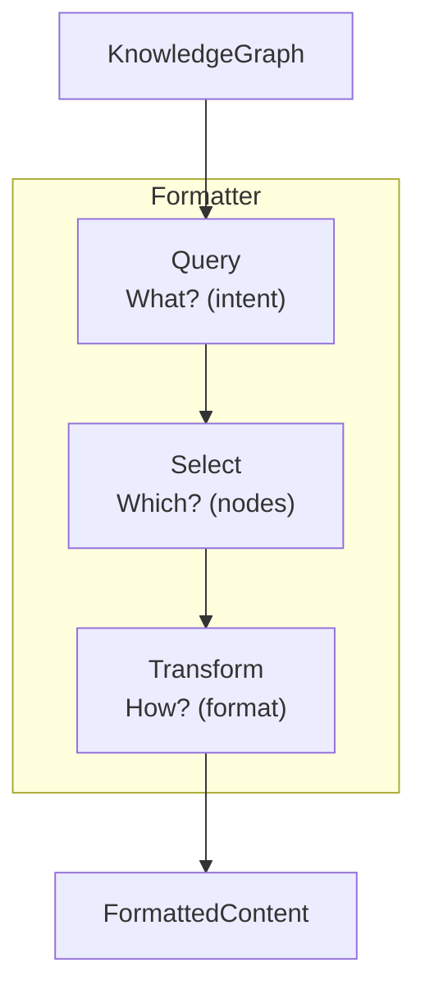
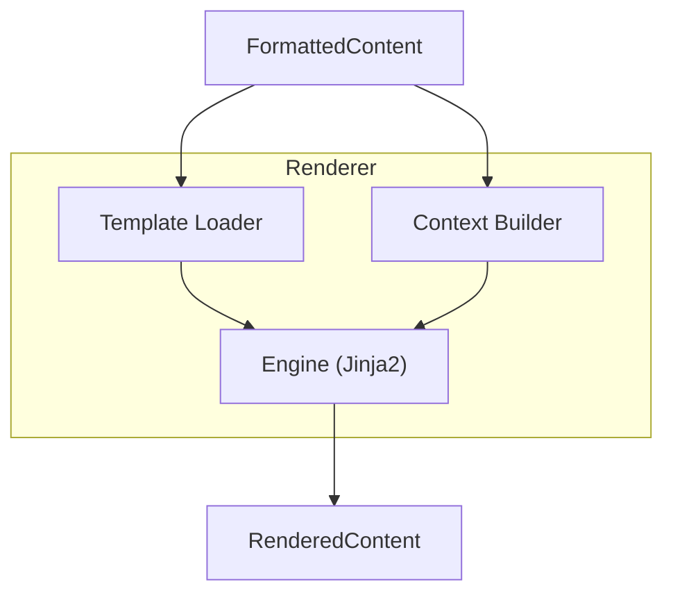
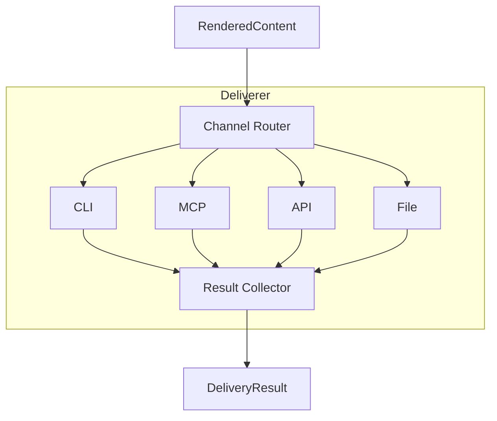
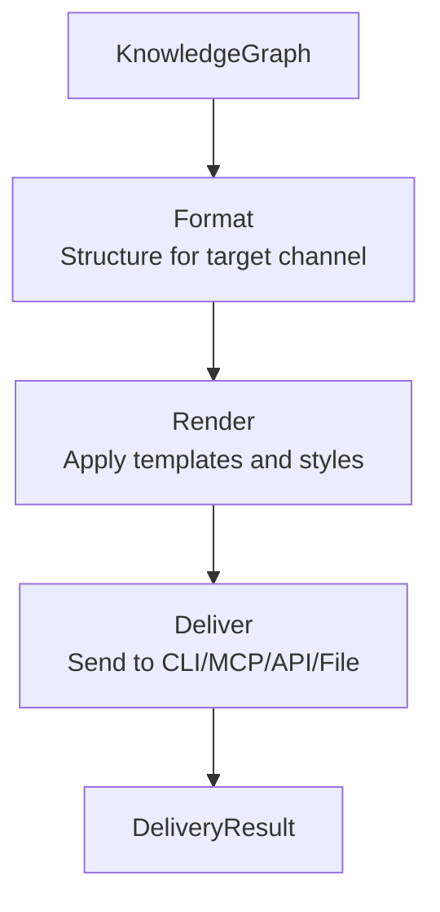

# Generate Protocol

> Output formatting, rendering, and multi-channel delivery

---

## 1. Overview

The Generate protocol (G in SAGE) transforms analyzed knowledge into user-facing outputs across multiple delivery channels.

## Table of Contents

- [1. Overview](#1-overview)
- [2. Responsibilities](#2-responsibilities)
- [3. Formatting](#3-formatting)
- [4. Rendering](#4-rendering)
- [5. Delivery](#5-delivery)
- [6. Generation Pipeline](#6-generation-pipeline)
- [7. Channel Adapters](#7-channel-adapters)
- [8. Configuration](#8-configuration)
- [Related](#related)

---

## 2. Responsibilities

| Operation | Purpose | Output |
|-----------|---------|--------|
| **Format** | Structure for target | FormattedContent |
| **Render** | Apply templates | RenderedContent |
| **Deliver** | Send to channel | DeliveryResult |

---

## 3. Formatting

### 3.1 Format Types

| Format | Use Case | Example |
|--------|----------|---------|
| **Markdown** | Documentation | `.md` files |
| **HTML** | Web output | Web pages |
| **JSON** | API responses | REST API |
| **Plain** | CLI output | Terminal |
| **Structured** | MCP protocol | Tool responses |

### 3.2 Formatting Flow


### 3.3 Formatted Content Structure

```python
@dataclass
class FormattedContent:
    id: str
    format_type: str
    content: str | dict | list
    metadata: dict[str, Any]
    source_nodes: list[str]
```
---

## 4. Rendering

### 4.1 Template System

| Template Type | Purpose | Example |
|---------------|---------|---------|
| **Document** | Full documents | Design doc template |
| **Section** | Document parts | Code block template |
| **Component** | UI components | Table template |
| **Inline** | Text fragments | Link template |

### 4.2 Rendering Flow


### 4.3 Rendered Content Structure

```python
@dataclass
class RenderedContent:
    id: str
    content: str
    content_type: str  # text/markdown, text/html, etc.
    byte_size: int
    token_count: int | None
    render_time_ms: float
```
---

## 5. Delivery

### 5.1 Delivery Channels

| Channel | Interface | Format |
|---------|-----------|--------|
| **CLI** | Terminal | Plain text, colored |
| **MCP** | Protocol | Structured JSON |
| **API** | HTTP | JSON, HTML |
| **File** | Filesystem | Any format |
| **Stream** | Real-time | Chunked |

### 5.2 Delivery Flow


### 5.3 Delivery Result Structure

```python
@dataclass
class DeliveryResult:
    success: bool
    channel: str
    delivered_at: datetime
    byte_count: int
    duration_ms: float
    error: str | None
```
---

## 6. Generation Pipeline


---

## 7. Channel Adapters

### 7.1 CLI Adapter

```python
class CLIAdapter:
    def deliver(self, content: RenderedContent) -> DeliveryResult:
        # Handle terminal width
        # Apply ANSI colors
        # Manage pagination
        ...
```
### 7.2 MCP Adapter

```python
class MCPAdapter:
    def deliver(self, content: RenderedContent) -> DeliveryResult:
        # Format as MCP response
        # Handle token limits
        # Include metadata
        ...
```
### 7.3 API Adapter

```python
class APIAdapter:
    def deliver(self, content: RenderedContent) -> DeliveryResult:
        # Set content type
        # Handle compression
        # Manage caching
        ...
```
---

## 8. Configuration

```yaml
generate:
  formatting:
    default_format: markdown
    max_length: 50000
  
  rendering:
    template_path: "templates/"
    cache_templates: true
  
  delivery:
    cli:
      color: true
      pager: auto
    mcp:
      max_tokens: 8000
    api:
      compression: gzip
```
---

## Related

- `ANALYZE_PROTOCOL.md` — Previous phase
- `EVOLVE_PROTOCOL.md` — Next phase
- `../services/INDEX.md` — Service layer

---

*AI Collaboration Knowledge Base*
