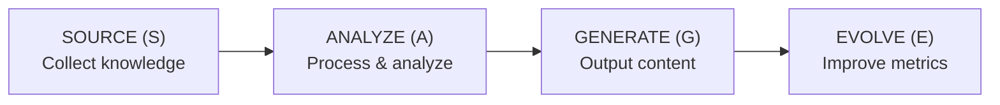

# Protocols

> SAGE protocol specifications and interfaces

---

## 1. Overview

SAGE follows the **Source → Analyze → Generate → Evolve** protocol pattern for all knowledge operations.

## Table of Contents

- [1. Overview](#1-overview)
- [2. Documents](#2-documents)
- [3. Protocol Pattern](#3-protocol-pattern)
- [4. Protocol Responsibilities](#4-protocol-responsibilities)

---
---

## 2. Documents

| Document | Description | Status |
|----------|-------------|--------|
| `SAGE_PROTOCOL.md` | Core SAGE protocol overview | Planned |
| `SOURCE_PROTOCOL.md` | Knowledge sourcing (S) | Planned |
| `ANALYZE_PROTOCOL.md` | Analysis and processing (A) | Planned |
| `GENERATE_PROTOCOL.md` | Output generation (G) | Planned |
| `EVOLVE_PROTOCOL.md` | Evolution and optimization (E) | Planned |

---

## 3. Protocol Pattern

---

## 4. Protocol Responsibilities

| Protocol | Input | Output | Key Operations |
|----------|-------|--------|----------------|
| **Source** | External data | Raw knowledge | Collect, validate, normalize |
| **Analyze** | Raw knowledge | Structured data | Parse, classify, relate |
| **Generate** | Structured data | User content | Format, render, deliver |
| **Evolve** | Metrics | Improvements | Measure, optimize, learn |

---

## Related

- `../philosophy/INDEX.md` — Design philosophy
- `../architecture/INDEX.md` — Architecture design
- `.context/decisions/ADR_0002_SAGE_PROTOCOL.md` — Protocol ADR

---

*AI Collaboration Knowledge Base*
