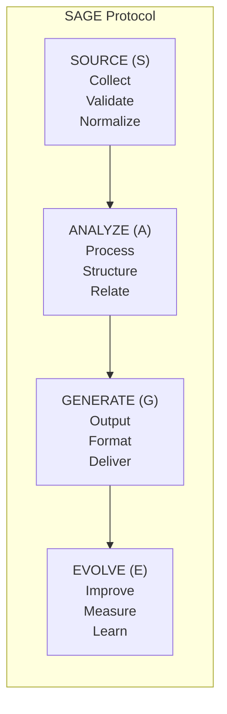

# SAGE Protocol

> Source, Analyze, Generate, Evolve — the core operational pattern

---

## 1. Overview

SAGE is an acronym representing the four-phase protocol for knowledge operations:

| Phase | Name | Purpose |
|-------|------|---------|
| **S** | Source | Collect and validate knowledge inputs |
| **A** | Analyze | Process, structure, and understand |
| **G** | Generate | Produce multi-channel outputs |
| **E** | Evolve | Measure, learn, and improve |


## Table of Contents

- [1. Overview](#1-overview)
- [2. Protocol Flow](#2-protocol-flow)
- [3. Phase Summaries](#3-phase-summaries)
- [4. Protocol Interfaces](#4-protocol-interfaces)
- [5. Data Flow](#5-data-flow)
- [6. Error Handling](#6-error-handling)
- [7. Extension Points](#7-extension-points)
- [Related](#related)

---

## 2. Protocol Flow


---

## 3. Phase Summaries

### 3.1 Source (S)

**Purpose:** Gather knowledge from various inputs

| Responsibility | Description |
|---------------|-------------|
| Collection | Gather from files, APIs, user input |
| Validation | Verify format and integrity |
| Normalization | Convert to standard format |

### 3.2 Analyze (A)

**Purpose:** Process and understand knowledge

| Responsibility | Description |
|---------------|-------------|
| Parsing | Extract structure and meaning |
| Classification | Categorize by type and topic |
| Relation | Build knowledge graph connections |

### 3.3 Generate (G)

**Purpose:** Produce useful outputs

| Responsibility | Description |
|---------------|-------------|
| Formatting | Structure for target channel |
| Rendering | Apply templates and styles |
| Delivery | Send to CLI, MCP, API, etc. |

### 3.4 Evolve (E)

**Purpose:** Continuously improve

| Responsibility | Description |
|---------------|-------------|
| Measurement | Track metrics and KPIs |
| Learning | Identify patterns and issues |
| Optimization | Apply improvements |

---

## 4. Protocol Interfaces

```python
from typing import Protocol

class SourceProtocol(Protocol):
    """Knowledge sourcing interface"""
    def collect(self, sources: list[str]) -> RawKnowledge: ...
    def validate(self, data: RawKnowledge) -> ValidationResult: ...
    def normalize(self, data: RawKnowledge) -> NormalizedKnowledge: ...

class AnalyzeProtocol(Protocol):
    """Knowledge analysis interface"""
    def parse(self, data: NormalizedKnowledge) -> ParsedKnowledge: ...
    def classify(self, data: ParsedKnowledge) -> ClassifiedKnowledge: ...
    def relate(self, data: ClassifiedKnowledge) -> KnowledgeGraph: ...

class GenerateProtocol(Protocol):
    """Output generation interface"""
    def format(self, data: KnowledgeGraph, target: str) -> FormattedContent: ...
    def render(self, content: FormattedContent) -> RenderedContent: ...
    def deliver(self, content: RenderedContent, channel: str) -> DeliveryResult: ...

class EvolveProtocol(Protocol):
    """Evolution and optimization interface"""
    def measure(self, operation: Operation) -> Metrics: ...
    def learn(self, metrics: Metrics) -> Insights: ...
    def optimize(self, insights: Insights) -> Improvements: ...
```
---

## 5. Data Flow

| Stage | Input | Output | Transform |
|-------|-------|--------|-----------|
| Source | External data | RawKnowledge | Collection |
| Analyze | RawKnowledge | KnowledgeGraph | Processing |
| Generate | KnowledgeGraph | RenderedContent | Formatting |
| Evolve | Metrics | Improvements | Learning |

---

## 6. Error Handling

Each phase handles errors according to the resilience pattern:

| Phase | On Error | Fallback |
|-------|----------|----------|
| Source | Log, retry | Use cached data |
| Analyze | Log, partial result | Skip problematic items |
| Generate | Log, degrade | Simplified output |
| Evolve | Log only | Continue without optimization |

---

## 7. Extension Points

| Phase | Extension Type | Example |
|-------|---------------|---------|
| Source | Custom collectors | Database connector |
| Analyze | Custom analyzers | Domain-specific parser |
| Generate | Custom generators | New output format |
| Evolve | Custom metrics | Business KPIs |

---

## Related

- `SOURCE_PROTOCOL.md` — Detailed source protocol
- `ANALYZE_PROTOCOL.md` — Detailed analyze protocol
- `GENERATE_PROTOCOL.md` — Detailed generate protocol
- `EVOLVE_PROTOCOL.md` — Detailed evolve protocol
- `../philosophy/XIN_DA_YA.md` — Design philosophy

---

*AI Collaboration Knowledge Base*
