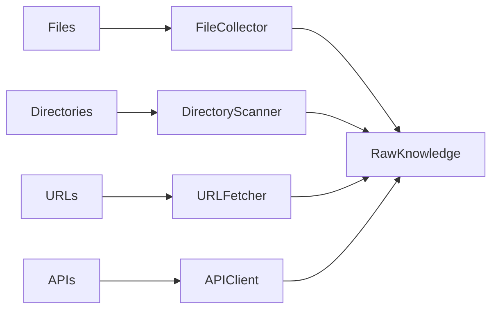
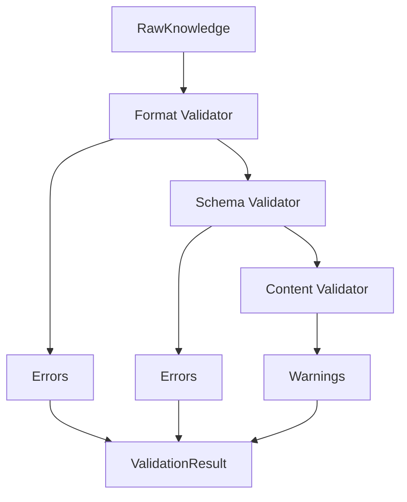
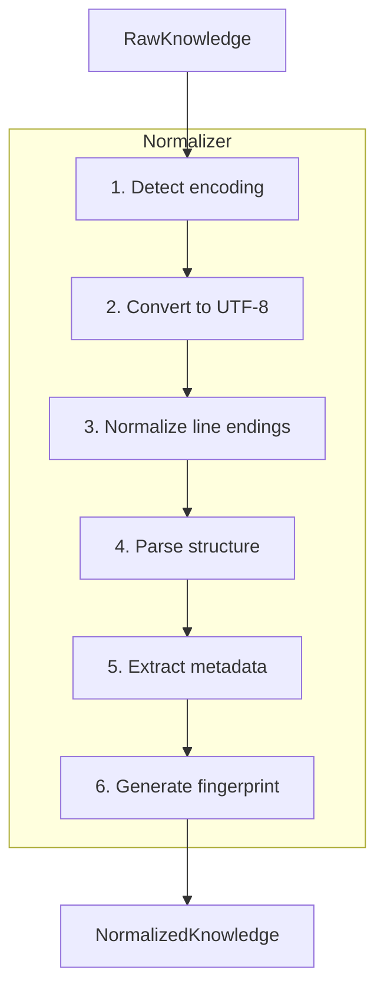

# Source Protocol

> Knowledge collection, validation, and normalization

---

## 1. Overview

The Source protocol (S in SAGE) handles all knowledge input operations, ensuring data is properly collected, validated, and normalized before processing.

## Table of Contents

- [1. Overview](#1-overview)
- [2. Responsibilities](#2-responsibilities)
- [3. Collection](#3-collection)
- [4. Validation](#4-validation)
- [5. Normalization](#5-normalization)
- [6. Error Handling](#6-error-handling)
- [7. Configuration](#7-configuration)
- [Related](#related)

---

## 2. Responsibilities

| Operation | Purpose | Output |
|-----------|---------|--------|
| **Collect** | Gather knowledge from sources | RawKnowledge |
| **Validate** | Verify integrity and format | ValidationResult |
| **Normalize** | Convert to standard format | NormalizedKnowledge |

---

## 3. Collection

### 3.1 Source Types

| Type | Description | Example |
|------|-------------|---------|
| **File** | Local filesystem | `.md`, `.yaml`, `.json` |
| **Directory** | Recursive file scan | `.knowledge/`, `docs/` |
| **URL** | Remote resources | HTTP/HTTPS endpoints |
| **API** | External services | REST, GraphQL |
| **Input** | User-provided | CLI arguments, stdin |

### 3.2 Collection Flow


### 3.3 Collection Interface

```python
class Collector(Protocol):
    def collect(self, source: str) -> RawKnowledge:
        """Collect knowledge from a source."""
        ...
    
    def supports(self, source: str) -> bool:
        """Check if collector supports this source type."""
        ...
```
---

## 4. Validation

### 4.1 Validation Levels

| Level | Check | Action on Failure |
|-------|-------|-------------------|
| **Format** | File readable, valid syntax | Reject |
| **Schema** | Structure matches expected | Reject |
| **Content** | Required fields present | Warn or Reject |
| **Quality** | Meets quality standards | Warn |

### 4.2 Validation Flow


### 4.3 Validation Result

```python
@dataclass
class ValidationResult:
    valid: bool
    errors: list[ValidationError]
    warnings: list[ValidationWarning]
    metadata: dict[str, Any]
```
---

## 5. Normalization

### 5.1 Normalization Steps

| Step | Purpose | Example |
|------|---------|---------|
| **Encoding** | Standardize to UTF-8 | Latin-1 → UTF-8 |
| **Line Endings** | Normalize to LF | CRLF → LF |
| **Structure** | Convert to internal format | YAML → dict |
| **Metadata** | Extract and attach | frontmatter → metadata |

### 5.2 Normalization Flow


### 5.3 Normalized Knowledge Structure

```python
@dataclass
class NormalizedKnowledge:
    id: str                    # Unique identifier
    source: str                # Original source path/URL
    content: str               # Normalized content
    metadata: dict[str, Any]   # Extracted metadata
    fingerprint: str           # Content hash
    collected_at: datetime     # Collection timestamp
```
---

## 6. Error Handling

| Error Type | Handling | Recovery |
|------------|----------|----------|
| **Source Not Found** | Log error | Skip, continue |
| **Permission Denied** | Log error | Skip, continue |
| **Invalid Format** | Log, reject | Use fallback if available |
| **Network Error** | Retry with backoff | Use cached version |
| **Timeout** | Log, abort | Use partial result |

---

## 7. Configuration

```yaml
source:
  # Collection settings
  collectors:
    file:
      enabled: true
      extensions: [".md", ".yaml", ".json"]
    url:
      enabled: true
      timeout: 5000ms
  
  # Validation settings
  validation:
    strict: false
    skip_warnings: false
  
  # Normalization settings
  normalization:
    encoding: "utf-8"
    line_endings: "lf"
```
---

## Related

- `SAGE_PROTOCOL.md` — Protocol overview
- `ANALYZE_PROTOCOL.md` — Next phase
- `../timeout_resilience/INDEX.md` — Timeout handling

---

*AI Collaboration Knowledge Base*
