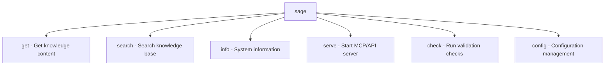

# CLI Service

> Command-line interface service using Typer and Rich

---

## 1. Overview

The CLI service provides interactive terminal access to SAGE knowledge base using Typer for command parsing and Rich for beautiful output formatting.

## Table of Contents

- [1. Overview](#1-overview)
- [2. Technology Stack](#2-technology-stack)
- [3. Command Structure](#3-command-structure)
- [4. Commands](#4-commands)
- [5. Implementation](#5-implementation)
- [6. Error Handling](#6-error-handling)
- [7. Progress and Feedback](#7-progress-and-feedback)
- [8. Configuration](#8-configuration)
- [9. Testing](#9-testing)
- [Related](#related)

---

## 2. Technology Stack

| Component | Library | Purpose |
|-----------|---------|---------|
| **Command Parser** | Typer | CLI framework with type hints |
| **Output Formatting** | Rich | Terminal formatting, tables, trees |
| **Progress** | Rich Progress | Progress bars for long operations |
| **Prompts** | Rich Prompt | Interactive user input |

---

## 3. Command Structure


---

## 4. Commands

### 4.1 sage get

```bash
sage get [OPTIONS] [QUERY]
Options:
  -l, --layer INTEGER    Knowledge layer (1-4)
  -t, --type TEXT        Content type filter
  -f, --format TEXT      Output format (rich|json|markdown)
  --timeout INTEGER      Timeout in milliseconds
  --no-cache            Disable caching
```
### 4.2 sage search

```bash
sage search [OPTIONS] QUERY
Options:
  -l, --layer INTEGER    Limit to specific layer
  -n, --max-results INT  Maximum results (default: 10)
  --fuzzy               Enable fuzzy matching
  --regex               Use regex pattern
```
### 4.3 sage info

```bash
sage info [OPTIONS]
Options:
  --health              Show health status
  --stats               Show statistics
  --config              Show configuration
  -v, --verbose         Verbose output
```
### 4.4 sage serve

```bash
sage serve [OPTIONS]
Options:
  --mcp                 Start MCP server (default)
  --api                 Start HTTP API server
  --port INTEGER        Server port
  --host TEXT           Server host
```
---

## 5. Implementation

### 5.1 Application Entry

```python
import typer
from rich.console import Console
app = typer.Typer(
    name="sage",
    help="SAGE Knowledge Base CLI",
    add_completion=True
)
console = Console()
@app.command()
def get(
    query: str = typer.Argument(None),
    layer: int = typer.Option(None, "--layer", "-l"),
    format: str = typer.Option("rich", "--format", "-f"),
    timeout: int = typer.Option(5000, "--timeout")
):
    """Get knowledge content."""
    container = get_container()
    loader = container.resolve(SourceProtocol)
    
    with console.status("Loading knowledge..."):
        result = loader.source(KnowledgeRequest(
            query=query,
            layer=layer,
            timeout_ms=timeout
        ))
    
    _output(result, format)
```
### 5.2 Output Formatting

```python
def _output(result: KnowledgeResult, format: str):
    if format == "json":
        console.print_json(data=result.to_dict())
    elif format == "markdown":
        console.print(Markdown(result.content))
    else:
        _rich_output(result)
def _rich_output(result: KnowledgeResult):
    table = Table(title="Knowledge Result")
    table.add_column("Field", style="cyan")
    table.add_column("Value", style="green")
    
    table.add_row("Layer", str(result.layer))
    table.add_row("Type", result.content_type)
    table.add_row("Tokens", str(result.token_count))
    
    console.print(table)
    console.print(Panel(result.content, title="Content"))
```
---

## 6. Error Handling

### 6.1 User-Friendly Errors

```python
@app.command()
def get(query: str):
    try:
        result = loader.source(request)
        _output(result)
    except TimeoutError as e:
        console.print(f"[red]Timeout:[/red] {e.message}")
        console.print("[dim]Try increasing --timeout[/dim]")
        raise typer.Exit(1)
    except ValidationError as e:
        console.print(f"[red]Invalid input:[/red] {e.message}")
        raise typer.Exit(2)
```
### 6.2 Exit Codes

| Code | Meaning |
|------|---------|
| 0 | Success |
| 1 | Timeout error |
| 2 | Validation error |
| 3 | Configuration error |
| 4 | Not found |
| 5 | Internal error |

---

## 7. Progress and Feedback

### 7.1 Progress Bar

```python
from rich.progress import Progress, SpinnerColumn, TextColumn
with Progress(
    SpinnerColumn(),
    TextColumn("[progress.description]{task.description}"),
    transient=True
) as progress:
    task = progress.add_task("Loading...", total=None)
    result = loader.source(request)
```
### 7.2 Status Messages

```python
with console.status("[bold green]Searching knowledge base..."):
    results = searcher.search(query)
console.print(f"[green]✓[/green] Found {len(results)} results")
```
---

## 8. Configuration

```yaml
services:
  cli:
    default_format: rich
    default_timeout: 5000
    color_system: auto
    show_progress: true
    pager_threshold: 100
```
---

## 9. Testing

### 9.1 CLI Testing with Typer

```python
from typer.testing import CliRunner
runner = CliRunner()
def test_get_command():
    result = runner.invoke(app, ["get", "test query"])
    assert result.exit_code == 0
    assert "Knowledge Result" in result.stdout
def test_get_with_timeout():
    result = runner.invoke(app, ["get", "--timeout", "100", "query"])
    assert result.exit_code in [0, 1]
```
---

## Related

- `SERVICE_LAYER.md` — Service layer overview
- `MCP_SERVICE.md` — MCP service
- `API_SERVICE.md` — HTTP API service
- `../timeout_resilience/INDEX.md` — Timeout patterns

---

*AI Collaboration Knowledge Base*
