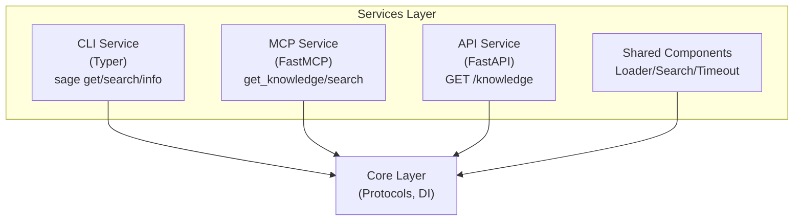
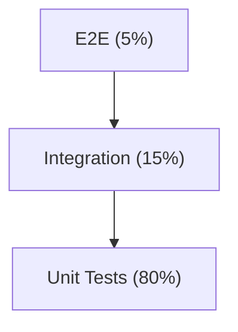

# Service Layer

> Multi-channel service architecture for SAGE

---

## 1. Overview

The service layer provides three channels for knowledge access: CLI, MCP, and HTTP API. All services share common components through dependency injection.

## Table of Contents

- [1. Overview](#1-overview)
- [2. Architecture](#2-architecture)
- [3. Service Comparison](#3-service-comparison)
- [4. Command/Tool Mapping](#4-commandtool-mapping)
- [5. Shared Components](#5-shared-components)
- [6. Error Handling](#6-error-handling)
- [7. Testing Strategy](#7-testing-strategy)
- [Related](#related)

---

## 2. Architecture


---

## 3. Service Comparison

| Feature | CLI | MCP | HTTP API |
|---------|-----|-----|----------|
| **Framework** | Typer + Rich | FastMCP | FastAPI |
| **Transport** | Terminal I/O | stdio/SSE | HTTP REST |
| **Output** | Rich formatting | JSON | JSON |
| **Auth** | N/A | Client-managed | Bearer token |
| **Use Case** | Interactive | AI integration | System integration |
| **Timeout** | Per-command | Per-tool | Per-request |

---

## 4. Command/Tool Mapping

| Operation | CLI Command | MCP Tool | API Endpoint |
|-----------|-------------|----------|--------------|
| Get knowledge | `sage get` | `get_knowledge` | `GET /v1/knowledge` |
| Search | `sage search` | `search_knowledge` | `GET /v1/search` |
| Get framework | `sage get -l 2` | `get_framework` | `GET /v1/frameworks` |
| System info | `sage info` | `kb_info` | `GET /health` |
| Start server | `sage serve` | N/A | N/A |

---

## 5. Shared Components

All services share core components via dependency injection:

| Component | Purpose | Interface |
|-----------|---------|-----------|
| **Loader** | Knowledge loading | `SourceProtocol` |
| **Search** | Content search | `AnalyzeProtocol` |
| **Timeout** | Timeout management | `TimeoutManager` |
| **Config** | Configuration access | `SAGEConfig` |
| **EventBus** | Inter-service communication | `EventBus` |

### 5.1 Dependency Injection Pattern

```python
from sage.core.di import get_container
from sage.core.protocols import SourceProtocol
container = get_container()
loader = container.resolve(SourceProtocol)
result = loader.source(request)
```
---

## 6. Error Handling

### 6.1 Error Code Ranges

| Range | Category | Example |
|-------|----------|---------|
| 1xxx | Loading | `SAGE-1001` TimeoutError |
| 2xxx | Configuration | `SAGE-2002` ValidationError |
| 3xxx | Service | `SAGE-3001` MCPError |
| 4xxx | Plugin | `SAGE-4001` PluginLoadError |

### 6.2 Error Response Format

```json
{
  "error": {
    "code": "SAGE-1001",
    "message": "Operation timed out",
    "details": {"timeout_ms": 5000},
    "recoverable": true
  }
}
```
### 6.3 Graceful Degradation

| Timeout Level | Action |
|---------------|--------|
| T1-T2 | Return cached content |
| T3 | Return partial + warning |
| T4-T5 | Return core only + error indication |

---

## 7. Testing Strategy

### 7.1 Test Pyramid


*Pyramid: Unit (80%) → Integration (15%) → E2E (5%)*

### 7.2 Coverage Targets

| Component | Target | Focus |
|-----------|--------|-------|
| `core/` | 90%+ | Protocols, timeout, DI |
| `services/` | 80%+ | CLI, MCP, API endpoints |
| `capabilities/` | 85%+ | Analyzers, checkers |

---

## Related

- `CLI_SERVICE.md` — CLI service details
- `MCP_SERVICE.md` — MCP service details
- `API_SERVICE.md` — HTTP API details
- `../core_engine/DI_CONTAINER.md` — Dependency injection

---

*AI Collaboration Knowledge Base*
