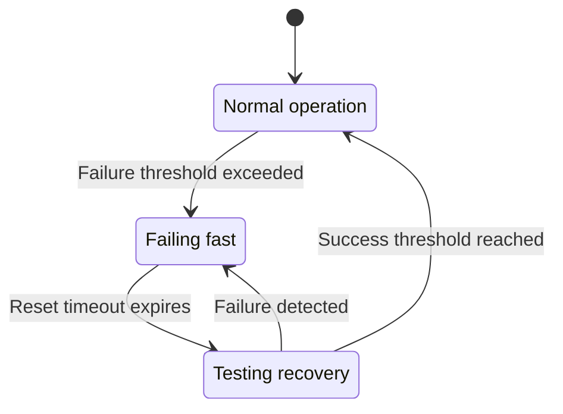

# Circuit Breaker

> Fail-fast pattern for handling repeated failures

---

## 1. Overview

The circuit breaker pattern prevents cascading failures by detecting repeated failures and temporarily blocking requests to failing services.


## Table of Contents

- [1. Overview](#1-overview)
- [2. Circuit States](#2-circuit-states)
- [3. State Diagram](#3-state-diagram)
- [4. Configuration](#4-configuration)
- [5. Implementation](#5-implementation)
- [6. Usage Patterns](#6-usage-patterns)
- [7. Registry](#7-registry)
- [8. Fallback Strategies](#8-fallback-strategies)
- [9. Monitoring](#9-monitoring)
- [10. Best Practices](#10-best-practices)
- [Related](#related)

---

## 2. Circuit States

| State | Description | Behavior |
|-------|-------------|----------|
| **Closed** | Normal operation | All requests pass through |
| **Open** | Failure threshold reached | Requests fail immediately |
| **Half-Open** | Testing recovery | Limited requests allowed |

---

## 3. State Diagram


---

## 4. Configuration

```python
@dataclass
class CircuitBreakerConfig:
    failure_threshold: int = 5      # Failures before opening
    success_threshold: int = 3      # Successes to close
    reset_timeout_ms: int = 30000   # Time before half-open
    half_open_max_calls: int = 3    # Max calls in half-open
```
---

## 5. Implementation

```python
from enum import Enum
from datetime import datetime, timedelta

class CircuitState(Enum):
    CLOSED = "closed"
    OPEN = "open"
    HALF_OPEN = "half_open"

class CircuitBreaker:
    def __init__(self, config: CircuitBreakerConfig):
        self.config = config
        self.state = CircuitState.CLOSED
        self.failure_count = 0
        self.success_count = 0
        self.last_failure_time: datetime | None = None
        self.half_open_calls = 0
    
    def can_execute(self) -> bool:
        if self.state == CircuitState.CLOSED:
            return True
        
        if self.state == CircuitState.OPEN:
            if self._should_attempt_reset():
                self._transition_to_half_open()
                return True
            return False
        
        if self.state == CircuitState.HALF_OPEN:
            return self.half_open_calls < self.config.half_open_max_calls
        
        return False
    
    def record_success(self) -> None:
        if self.state == CircuitState.HALF_OPEN:
            self.success_count += 1
            if self.success_count >= self.config.success_threshold:
                self._transition_to_closed()
        else:
            self.failure_count = 0
    
    def record_failure(self) -> None:
        self.failure_count += 1
        self.last_failure_time = datetime.now()
        
        if self.state == CircuitState.HALF_OPEN:
            self._transition_to_open()
        elif self.failure_count >= self.config.failure_threshold:
            self._transition_to_open()
```
---

## 6. Usage Patterns

### 6.1 Decorator Pattern

```python
def circuit_breaker(name: str):
    def decorator(func):
        breaker = get_circuit_breaker(name)
        
        @wraps(func)
        def wrapper(*args, **kwargs):
            if not breaker.can_execute():
                raise CircuitBreakerError(name)
            
            try:
                result = func(*args, **kwargs)
                breaker.record_success()
                return result
            except Exception as e:
                breaker.record_failure()
                raise
        
        return wrapper
    return decorator

# Usage
@circuit_breaker("external_api")
def call_external_api(url: str) -> Response:
    ...
```
### 6.2 Context Manager

```python
class CircuitBreakerContext:
    def __init__(self, breaker: CircuitBreaker):
        self.breaker = breaker
    
    def __enter__(self):
        if not self.breaker.can_execute():
            raise CircuitBreakerError()
        return self
    
    def __exit__(self, exc_type, exc_val, exc_tb):
        if exc_type is None:
            self.breaker.record_success()
        else:
            self.breaker.record_failure()
        return False

# Usage
with CircuitBreakerContext(breaker):
    result = external_call()
```
---

## 7. Registry

```python
class CircuitBreakerRegistry:
    def __init__(self):
        self._breakers: dict[str, CircuitBreaker] = {}
    
    def get_or_create(self, name: str, config: CircuitBreakerConfig) -> CircuitBreaker:
        if name not in self._breakers:
            self._breakers[name] = CircuitBreaker(config)
        return self._breakers[name]
    
    def get_status(self) -> dict[str, dict]:
        return {
            name: {
                "state": breaker.state.value,
                "failure_count": breaker.failure_count
            }
            for name, breaker in self._breakers.items()
        }
```
---

## 8. Fallback Strategies

| Strategy | Description | Use Case |
|----------|-------------|----------|
| **Default** | Return default value | Non-critical data |
| **Cache** | Return cached data | Stale-while-revalidate |
| **Error** | Raise exception | Critical operations |
| **Alternative** | Use backup service | Redundant systems |

```python
@circuit_breaker("api", fallback=lambda: cached_response)
def get_data() -> Data:
    return api.fetch_data()
```
---

## 9. Monitoring

### 9.1 Metrics

| Metric | Description |
|--------|-------------|
| `circuit_state` | Current state (0=closed, 1=open, 2=half-open) |
| `circuit_failures` | Total failure count |
| `circuit_opens` | Times circuit opened |
| `circuit_resets` | Successful resets |

### 9.2 Events

```python
# Published when circuit state changes
event_bus.publish(Event(
    topic="circuit.state_changed",
    payload={
        "name": "external_api",
        "old_state": "closed",
        "new_state": "open",
        "failure_count": 5
    }
))
```
---

## 10. Best Practices

| Practice | Description |
|----------|-------------|
| **Separate circuits** | One per external dependency |
| **Appropriate thresholds** | Based on failure patterns |
| **Monitor states** | Alert on state changes |
| **Provide fallbacks** | Graceful degradation |

---

## Related

- `TIMEOUT_HIERARCHY.md` — Timeout levels
- `GRACEFUL_DEGRADATION.md` — Degradation strategies
- `../core_engine/EXCEPTIONS.md` — CircuitBreakerError

---

*AI Collaboration Knowledge Base*
