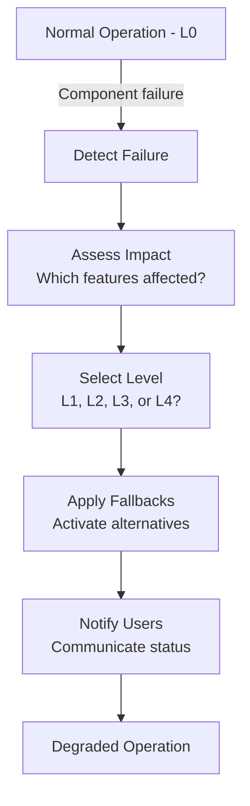
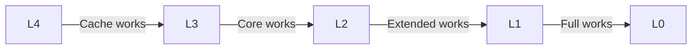

# Graceful Degradation

> Strategies for maintaining partial functionality during failures

---

## 1. Overview

Graceful degradation ensures SAGE continues providing value even when components fail, by progressively reducing functionality rather than failing completely.

---

## 2. Degradation Levels

| Level | Capability | User Impact |
|-------|------------|-------------|
| **L0** | Full | 100% functionality |
| **L1** | Reduced | Non-critical features disabled |
| **L2** | Minimal | Core features only |
| **L3** | Emergency | Read-only, cached data |
| **L4** | Offline | Error message with guidance |

---

## 3. Degradation Flow



---

## 4. Degradation Strategies

### 4.1 Feature Flags

```python
class DegradationManager:
    def __init__(self):
        self.level = DegradationLevel.L0
        self.disabled_features: set[str] = set()
    
    def is_feature_available(self, feature: str) -> bool:
        if feature in self.disabled_features:
            return False
        return FEATURE_LEVELS[feature] <= self.level
    
    def degrade_to(self, level: DegradationLevel) -> None:
        self.level = level
        self._update_disabled_features()
        self._notify_status_change()
```

### 4.2 Fallback Chain

```python
class FallbackChain:
    def __init__(self, *strategies):
        self.strategies = strategies
    
    def execute(self, operation: str, *args) -> Result:
        for strategy in self.strategies:
            try:
                result = strategy.execute(operation, *args)
                if result.success:
                    return result
            except Exception as e:
                logger.warning(f"Strategy {strategy} failed: {e}")
                continue
        
        return Result.fail("All strategies exhausted")

# Usage
chain = FallbackChain(
    PrimaryService(),
    CachedResponse(),
    DefaultValue(),
    ErrorMessage()
)
```

---

## 5. Component Fallbacks

### 5.1 Knowledge Loading

| Primary | Fallback 1 | Fallback 2 | Fallback 3 |
|---------|------------|------------|------------|
| Full load | Lazy load | Cached only | Index only |

```python
def load_knowledge(asset_id: str) -> KnowledgeAsset:
    # Try full load
    try:
        return loader.load(asset_id)
    except LoadError:
        pass
    
    # Try cache
    cached = cache.get(asset_id)
    if cached:
        return cached
    
    # Return minimal stub
    return KnowledgeAsset.stub(asset_id)
```

### 5.2 External Services

| Primary | Fallback 1 | Fallback 2 |
|---------|------------|------------|
| Live API | Cached response | Default data |

### 5.3 Analysis

| Primary | Fallback 1 | Fallback 2 |
|---------|------------|------------|
| Full analysis | Basic parsing | Raw content |

---

## 6. User Communication

### 6.1 Status Indicators

```python
@dataclass
class SystemStatus:
    level: DegradationLevel
    message: str
    affected_features: list[str]
    estimated_recovery: datetime | None

def get_status_message(level: DegradationLevel) -> str:
    messages = {
        L0: "All systems operational",
        L1: "Some features temporarily unavailable",
        L2: "Running in reduced mode",
        L3: "Emergency mode - limited functionality",
        L4: "Service unavailable - please try later"
    }
    return messages[level]
```

### 6.2 Response Headers

```python
# Add degradation info to API responses
response.headers["X-SAGE-Status"] = status.level.name
response.headers["X-SAGE-Degraded-Features"] = ",".join(status.affected_features)
```

---

## 7. Recovery

### 7.1 Health Checks

```python
class HealthChecker:
    async def check_all(self) -> dict[str, bool]:
        return {
            "knowledge_loader": await self._check_loader(),
            "cache": await self._check_cache(),
            "external_api": await self._check_api(),
        }
    
    async def attempt_recovery(self) -> None:
        health = await self.check_all()
        
        if all(health.values()):
            degradation_manager.recover_to(L0)
        elif health["knowledge_loader"]:
            degradation_manager.recover_to(L1)
```

### 7.2 Progressive Recovery



---

## 8. Configuration

```yaml
degradation:
  auto_degrade: true
  health_check_interval: 30s
  
  levels:
    L1:
      disabled:
        - advanced_analysis
        - external_enrichment
    L2:
      disabled:
        - real_time_updates
        - batch_operations
    L3:
      disabled:
        - write_operations
        - new_sessions
```

---

## 9. Monitoring

### 9.1 Metrics

| Metric | Description |
|--------|-------------|
| `degradation_level` | Current level (0-4) |
| `degradation_duration` | Time in degraded state |
| `fallback_invocations` | Fallback usage count |
| `recovery_attempts` | Recovery attempt count |

### 9.2 Alerts

| Condition | Alert Level |
|-----------|-------------|
| L1 for > 5 min | Warning |
| L2 for > 1 min | Error |
| L3 or L4 | Critical |

---

## 10. Best Practices

| Practice | Description |
|----------|-------------|
| **Test fallbacks** | Regularly test degradation paths |
| **Communicate clearly** | Users should understand limitations |
| **Recover gradually** | Don't jump from L4 to L0 |
| **Log transitions** | Track all level changes |
| **Set timeouts** | Auto-recovery attempts |

---

## Related

- `TIMEOUT_HIERARCHY.md` — Timeout levels
- `CIRCUIT_BREAKER.md` — Failure detection
- `SMART_LOADING.md` — Loading strategies

---

*Part of SAGE Knowledge Base*
