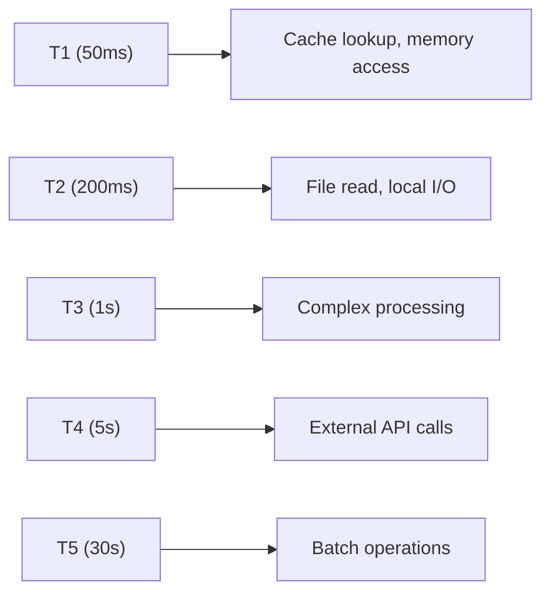

# Timeout & Resilience

> Timeout hierarchy and resilience patterns for SAGE

---

## 1. Overview

This directory documents SAGE's approach to handling timeouts, failures, and graceful degradation.

---

## 2. Documents

| Document | Description | Status |
|----------|-------------|--------|
| `TIMEOUT_HIERARCHY.md` | T1-T5 timeout levels | Planned |
| `CIRCUIT_BREAKER.md` | Circuit breaker pattern | Planned |
| `GRACEFUL_DEGRADATION.md` | Graceful degradation strategies | Planned |
| `SMART_LOADING.md` | Intelligent content loading | Planned |

---

## 3. Timeout Hierarchy

---

## 4. Resilience Patterns

| Pattern | Purpose | Use Case |
|---------|---------|----------|
| **Timeout** | Prevent hanging | All I/O operations |
| **Circuit Breaker** | Fail fast | Repeated failures |
| **Retry** | Handle transient failures | Network errors |
| **Fallback** | Graceful degradation | Service unavailable |

---

## 5. Key Principles

1. **Never block indefinitely** — All operations have timeouts
2. **Fail fast** — Detect failures quickly
3. **Degrade gracefully** — Provide partial results when possible
4. **Be observable** — Log and metric all failures

---

## Related

- `docs/design/core_engine/INDEX.md` — Core engine
- `docs/design/services/INDEX.md` — Service layer
- `.context/decisions/ADR_0003_TIMEOUT_HIERARCHY.md` — Timeout ADR

---

*AI Collaboration Knowledge Base*
