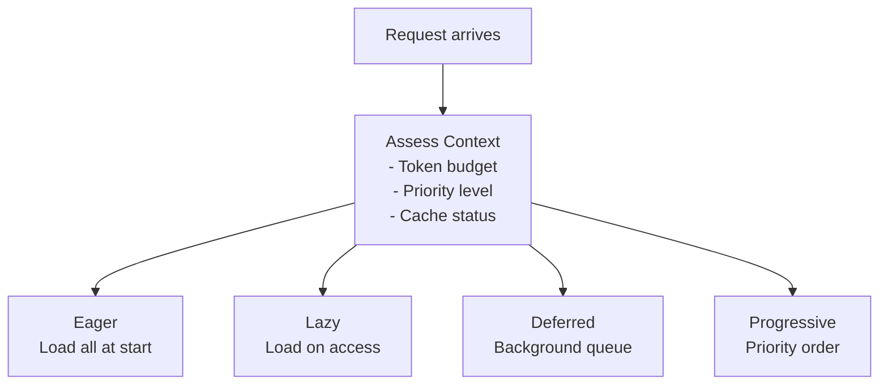
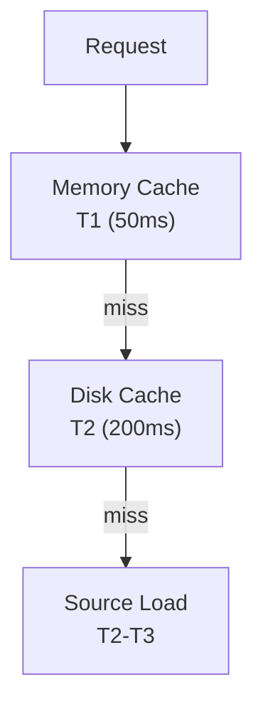

# Smart Loading

> Intelligent content loading strategies for optimal performance

---

## 1. Overview

Smart loading optimizes knowledge delivery by choosing the right loading strategy based on context, token budget, and user needs.

---

## 2. Loading Strategies

| Strategy | Description | Use Case |
|----------|-------------|----------|
| **Eager** | Load everything upfront | Startup, batch ops |
| **Lazy** | Load on demand | Interactive sessions |
| **Deferred** | Load in background | Non-critical content |
| **Progressive** | Load in priority order | Large knowledge bases |

---

## 3. Strategy Selection



---

## 4. Eager Loading

### 4.1 Description

Load all required knowledge at startup or session beginning.

### 4.2 Implementation

```python
class EagerLoader:
    def load(self, knowledge_ids: list[str]) -> dict[str, KnowledgeAsset]:
        results = {}
        for kid in knowledge_ids:
            results[kid] = self._load_asset(kid)
        return results
```

### 4.3 Use Cases

- System startup
- Batch processing
- Known small datasets
- Performance-critical paths

### 4.4 Trade-offs

| Pro | Con |
|-----|-----|
| Fast access after load | High initial latency |
| Predictable memory | May load unused content |
| Simple implementation | Doesn't scale well |

---

## 5. Lazy Loading

### 5.1 Description

Load knowledge only when first accessed.

### 5.2 Implementation

```python
class LazyLoader:
    def __init__(self):
        self._cache: dict[str, KnowledgeAsset] = {}
        self._loading: set[str] = set()
    
    def get(self, knowledge_id: str) -> KnowledgeAsset:
        if knowledge_id not in self._cache:
            self._cache[knowledge_id] = self._load_asset(knowledge_id)
        return self._cache[knowledge_id]
    
    async def get_async(self, knowledge_id: str) -> KnowledgeAsset:
        if knowledge_id in self._loading:
            await self._wait_for_load(knowledge_id)
        
        if knowledge_id not in self._cache:
            self._loading.add(knowledge_id)
            try:
                self._cache[knowledge_id] = await self._load_asset_async(knowledge_id)
            finally:
                self._loading.remove(knowledge_id)
        
        return self._cache[knowledge_id]
```

### 5.3 Use Cases

- Interactive sessions
- Large knowledge bases
- Memory-constrained environments

### 5.4 Trade-offs

| Pro | Con |
|-----|-----|
| Low startup time | First access latency |
| Memory efficient | Complexity |
| Scales well | Cache management needed |

---

## 6. Deferred Loading

### 6.1 Description

Load content in background without blocking main operations.

### 6.2 Implementation

```python
class DeferredLoader:
    def __init__(self):
        self._queue: asyncio.Queue = asyncio.Queue()
        self._task: asyncio.Task | None = None
    
    def schedule(self, knowledge_id: str) -> None:
        self._queue.put_nowait(knowledge_id)
        self._ensure_worker()
    
    async def _worker(self) -> None:
        while True:
            kid = await self._queue.get()
            try:
                await self._load_in_background(kid)
            except Exception as e:
                logger.warning(f"Deferred load failed: {e}")
            finally:
                self._queue.task_done()
```

### 6.3 Use Cases

- Pre-fetching related content
- Refreshing cache
- Non-critical updates

---

## 7. Progressive Loading

### 7.1 Description

Load content in priority order, delivering value incrementally.

### 7.2 Priority Levels

| Priority | Content Type | Load Order |
|----------|--------------|------------|
| **P1** | Core knowledge | Immediate |
| **P2** | Frequently used | Early |
| **P3** | Reference docs | Normal |
| **P4** | Archives | Deferred |

### 7.3 Implementation

```python
class ProgressiveLoader:
    def __init__(self, token_budget: int):
        self.budget = token_budget
        self.used = 0
    
    async def load_progressive(self, assets: list[AssetInfo]) -> AsyncIterator[KnowledgeAsset]:
        # Sort by priority
        sorted_assets = sorted(assets, key=lambda a: a.priority)
        
        for asset_info in sorted_assets:
            # Check budget
            if self.used + asset_info.token_estimate > self.budget:
                logger.info(f"Budget exhausted at {self.used} tokens")
                break
            
            # Load and yield
            asset = await self._load_asset(asset_info.id)
            self.used += asset.token_count
            yield asset
```

---

## 8. Token Budget Management

### 8.1 Budget Allocation

```python
@dataclass
class TokenBudget:
    total: int = 50000
    reserved_system: int = 5000
    reserved_response: int = 10000
    
    @property
    def available_for_knowledge(self) -> int:
        return self.total - self.reserved_system - self.reserved_response
```

### 8.2 Budget-Aware Loading

```python
class BudgetAwareLoader:
    def select_assets(self, 
                      candidates: list[AssetInfo], 
                      budget: int) -> list[AssetInfo]:
        selected = []
        remaining = budget
        
        for asset in sorted(candidates, key=lambda a: a.priority):
            if asset.token_estimate <= remaining:
                selected.append(asset)
                remaining -= asset.token_estimate
        
        return selected
```

---

## 9. Caching Integration

### 9.1 Cache Layers



### 9.2 Cache Keys

```python
def cache_key(asset_id: str, version: str | None = None) -> str:
    if version:
        return f"{asset_id}:{version}"
    return asset_id
```

---

## 10. Configuration

```yaml
loading:
  default_strategy: lazy
  
  eager:
    max_items: 100
    timeout_ms: 5000
  
  lazy:
    cache_size: 1000
    ttl_seconds: 3600
  
  deferred:
    queue_size: 500
    workers: 2
  
  progressive:
    token_budget: 50000
    priorities:
      P1: 0.4  # 40% of budget
      P2: 0.3
      P3: 0.2
      P4: 0.1
```

---

## 11. Monitoring

| Metric | Description |
|--------|-------------|
| `load_strategy_used` | Strategy selection count |
| `cache_hit_rate` | Cache effectiveness |
| `token_budget_usage` | Budget utilization |
| `load_latency_ms` | Loading time by strategy |

---

## Related

- `TIMEOUT_HIERARCHY.md` — Timeout levels
- `GRACEFUL_DEGRADATION.md` — Fallback strategies
- `../knowledge_system/LOADING_STRATEGY.md` — Detailed loading

---

*Part of SAGE Knowledge Base*
