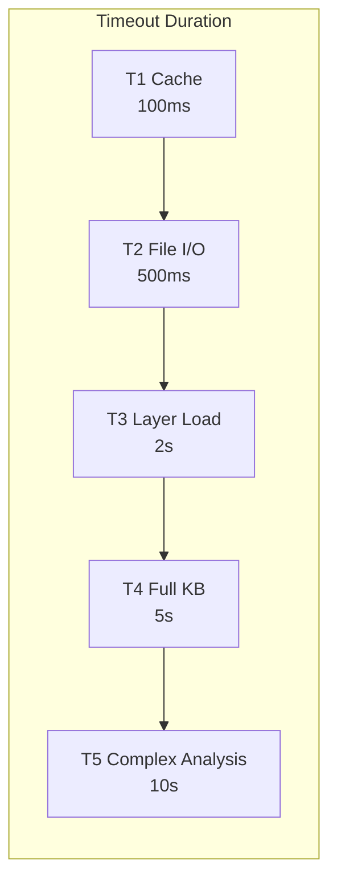

# Timeout Hierarchy

> T1-T5 timeout levels design documentation
>
> **Authoritative Configuration**: `.context/policies/TIMEOUT_HIERARCHY.md`
---

## 1. Overview

SAGE uses a five-tier timeout hierarchy (T1-T5) to classify operations by expected duration and set appropriate timeout values.

> **Note**: For project-specific timeout values, see `.context/policies/TIMEOUT_HIERARCHY.md`.
> This document describes the design rationale and implementation patterns.


## Table of Contents

- [1. Overview](#1-overview)
- [2. Timeout Levels](#2-timeout-levels)
- [3. Timeout Diagram](#3-timeout-diagram)
- [4. T1: Cache (100ms)](#4-t1-cache-100ms)
- [5. T2: File (500ms)](#5-t2-file-500ms)
- [6. T3: Layer (2s)](#6-t3-layer-2s)
- [7. T4: Full (5s)](#7-t4-full-5s)
- [8. T5: Complex (10s)](#8-t5-complex-10s)
- [9. Implementation](#9-implementation)
- [10. Monitoring](#10-monitoring)
- [Related](#related)

---

## 2. Timeout Levels

| Level | Name | Timeout | Scope | Fallback |
|-------|------|---------|-------|----------|
| **T1** | Cache | 100ms | Cache lookup | Skip cache |
| **T2** | File | 500ms | Single file | Use fallback |
| **T3** | Layer | 2s | Full layer | Partial load |
| **T4** | Full | 5s | Complete KB | Core only |
| **T5** | Complex | 10s | Analysis | Abort + summary |

---

## 3. Timeout Diagram


---

## 4. T1: Cache (100ms)

### 4.1 Description

Operations that should complete almost instantly, typically in-memory cache operations.

### 4.2 Operations

| Operation | Expected | Max |
|-----------|----------|-----|
| Cache lookup | < 50ms | 100ms |
| Memory read | < 20ms | 100ms |
| Hash computation | < 50ms | 100ms |
| Config access | < 30ms | 100ms |

### 4.3 On Timeout

```python
# T1 timeout - skip cache, proceed to file
if operation_time > T1_TIMEOUT:
    logger.warning("T1 cache timeout - skipping cache")
    return None  # Proceed to file read
```
---

## 5. T2: File (500ms)

### 5.1 Description

Local I/O operations that should be fast but involve disk access.

### 5.2 Operations

| Operation | Expected | Max |
|-----------|----------|-----|
| File read | < 200ms | 500ms |
| Directory scan | < 300ms | 500ms |
| Local DB query | < 200ms | 500ms |
| File write | < 200ms | 500ms |

### 5.3 On Timeout

```python
# T2 timeout - use fallback content
if operation_time > T2_TIMEOUT:
    logger.warning("T2 file timeout - using fallback")
    return get_embedded_fallback(path)
```
---

## 6. T3: Layer (2s)

### 6.1 Description

Operations loading an entire knowledge layer.

### 6.2 Operations

| Operation | Expected | Max |
|-----------|----------|-----|
| Layer load | < 1s | 2s |
| Knowledge indexing | < 1.5s | 2s |
| Template rendering | < 500ms | 2s |
| Validation | < 1s | 2s |

### 6.3 On Timeout

```python
# T3 timeout - return partial results
if operation_time > T3_TIMEOUT:
    logger.warning("T3 layer timeout - returning partial")
    return partial_result
```
---

## 7. T4: Full (5s)

### 7.1 Description

Operations loading the complete knowledge base.

### 7.2 Operations

| Operation | Expected | Max |
|-----------|----------|-----|
| Full KB load | < 3s | 5s |
| Cross-layer search | < 2s | 5s |
| Complete validation | < 3s | 5s |
| Export preparation | < 3s | 5s |

### 7.3 On Timeout

```python
# T4 timeout - return core only
if operation_time > T4_TIMEOUT:
    logger.warning("T4 full timeout - returning core only")
    return get_core_principles()
```
---

## 8. T5: Complex (10s)

### 8.1 Description

Complex analysis operations that require extended processing.

### 8.2 Operations

| Operation | Expected | Max |
|-----------|----------|-----|
| Complex analysis | < 5s | 10s |
| Full validation | < 7s | 10s |
| Index rebuild | < 8s | 10s |
| Batch processing | < 8s | 10s |

### 8.3 On Timeout

```python
# T5 timeout - abort and return summary
if operation_time > T5_TIMEOUT:
    logger.error("T5 analysis timeout - returning summary")
    return generate_summary(partial_result)
```
---

## 9. Implementation

### 9.1 Timeout Decorator

```python
from functools import wraps

def with_timeout(level: str):
    timeouts = {
        "T1": 100, "T2": 500, "T3": 2000, 
        "T4": 5000, "T5": 10000
    }
    
    def decorator(func):
        @wraps(func)
        async def wrapper(*args, **kwargs):
            timeout_ms = timeouts[level]
            try:
                return await asyncio.wait_for(
                    func(*args, **kwargs),
                    timeout=timeout_ms / 1000
                )
            except asyncio.TimeoutError:
                raise TimeoutError(func.__name__, timeout_ms)
        return wrapper
    return decorator

# Usage
@with_timeout("T2")
async def read_file(path: str) -> str:
    ...
```
### 9.2 Configuration Reference

See `.context/policies/TIMEOUT_HIERARCHY.md` for the authoritative configuration:

```yaml
timeout:
  operations:
    cache_lookup: 100ms    # T1
    file_read: 500ms       # T2
    layer_load: 2s         # T3
    full_load: 5s          # T4
    analysis: 10s          # T5
```
---

## 10. Monitoring

### 10.1 Metrics

| Metric | Description |
|--------|-------------|
| `operation_duration_ms` | Actual operation time |
| `timeout_violations` | Count by level |
| `timeout_percentage` | % of operations timing out |

### 10.2 Alerting

| Level | Threshold | Alert |
|-------|-----------|-------|
| T1 | > 1% | Critical |
| T2 | > 5% | Warning |
| T3 | > 10% | Info |
| T4 | > 20% | Warning |
| T5 | > 30% | Info |

---

## Related

- `.context/policies/TIMEOUT_HIERARCHY.md` — **Authoritative timeout values**
- `.knowledge/frameworks/resilience/TIMEOUT_PATTERNS.md` — Universal timeout patterns
- `CIRCUIT_BREAKER.md` — Failure handling
- `GRACEFUL_DEGRADATION.md` — Degradation strategies

---

*AI Collaboration Knowledge Base*
